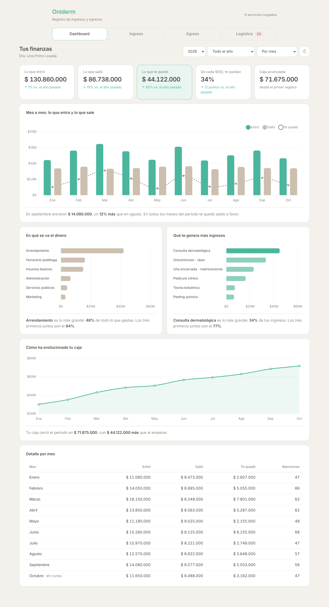
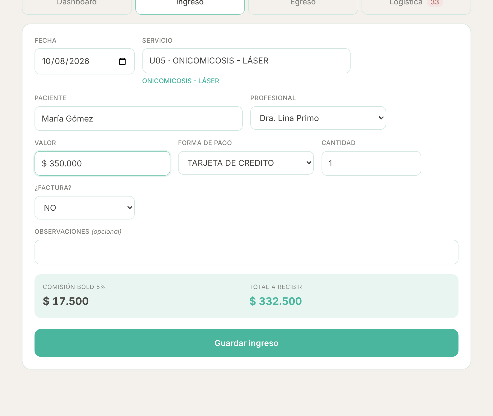
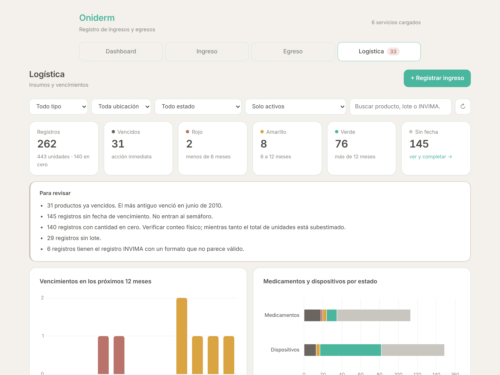
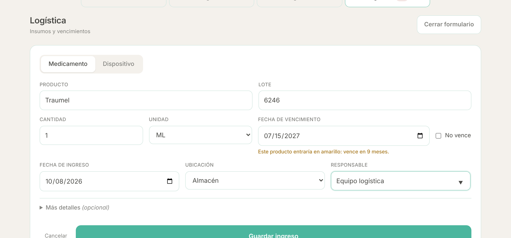
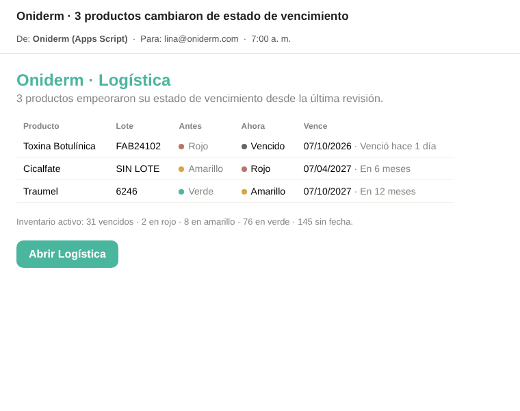
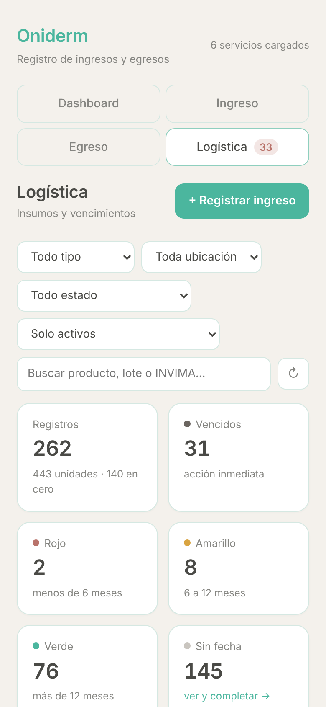
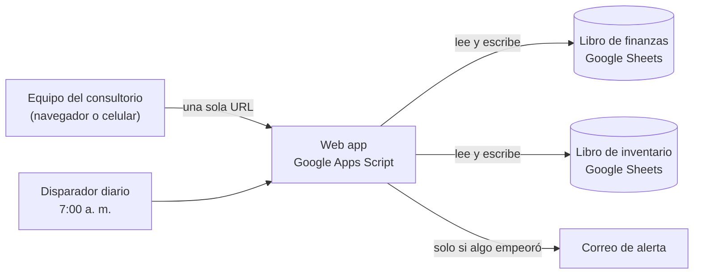

<div align="center">

# Oniderm · Gestión financiera y logística

**Web app a medida para un consultorio dermatológico en Colombia.**
Registro de ingresos y egresos, tablero financiero e inventario de medicamentos con semáforo de vencimientos,
todo en una sola interfaz construida sobre Google Workspace.


[](LICENSE)



</div>

---

## El reto

Oniderm es el consultorio de la Dra. Lina Primo Losada, especialista en dermatología y uñas. Toda su operación
vivía en hojas de cálculo que el equipo llenaba a mano:

- **Finanzas.** Cuatro hojas por año (ingresos y egresos por semestre) con fechas en varios formatos, valores
  escritos como texto (`$ 210.000,00`), códigos de servicio mal digitados (`CO1` en vez de `C01`) y listas
  desplegables que se rompían y bloqueaban el registro.
- **Inventario.** Un Excel de 6 hojas para medicamentos y dispositivos médicos donde la fecha de vencimiento estaba
  partida en tres columnas (día, mes y año). **El 55 % de los registros no tenía una fecha de vencimiento utilizable**
  y nadie sabía qué estaba vencido.

Para un consultorio habilitado esto no es solo incómodo: es un riesgo sanitario y regulatorio.

## La solución

Una **web app única** con cuatro pestañas, publicada desde Google Apps Script. No hay servidores que pagar ni que
mantener: los datos siguen en Google Sheets, donde el equipo ya trabajaba, y la app les pone encima una interfaz
clara, reglas de negocio y alertas.

| | |
| --- | --- |
|  |  |
| **Registro de ingresos y egresos** con cálculo automático de la comisión del datáfono. | **Inventario con semáforo** de vencimientos, alertas y acciones por producto. |

## Funcionalidades

### 💰 Finanzas
- **Registro de ingresos:** búsqueda de servicios por código o nombre, formato de pesos mientras se escribe y
  **cálculo automático de la comisión BOLD (5 %)** cuando el pago es con tarjeta.
- **Registro de egresos** por concepto contable, con soporte y número de soporte.
- Cada movimiento se guarda en la hoja del semestre correcto según su fecha, con mes y año calculados.
- **Tablero financiero:** lo que entró, lo que salió, margen y caja acumulada, comparados con el año anterior.
  Incluye gráficos mes a mes, en qué se va el dinero, qué servicios generan más ingresos y cómo evoluciona la caja.
- **Lecturas en lenguaje natural** bajo cada gráfico (*"Arrendamiento es lo más grande: 48 % de todo lo que gastas"*)
  y una sección **"Para revisar"** que detecta meses sin gastos registrados, gastos que crecen más rápido que los
  ingresos o caídas de ingresos.

### 📦 Logística
- **Semáforo de 6 estados** calculado cada día contra la fecha de hoy (hora de Bogotá): vencido, rojo (menos de
  6 meses), amarillo (6 a 12 meses), verde, sin fecha y no vence.
- **Registro de insumos** con autocompletado de productos ya conocidos. El formulario solo muestra los campos del
  tipo elegido (medicamento o dispositivo) y **avisa en vivo en qué estado entraría el producto** antes de guardarlo.
- **Detección de duplicados** (producto + lote + vencimiento): pregunta si se suma al registro existente o se crea
  uno aparte. Avisa, pero nunca bloquea.
- **Trazabilidad completa:** nunca se borra una fila. Los productos se marcan como *agotados* o *descartados* con
  fecha y motivo, que es lo que exige una visita de habilitación.
- **Contador en la pestaña** (`Logística 33`) visible desde cualquier parte de la app.
- **Alerta diaria por correo** a las 7 a. m., **solo cuando algún producto empeora** (verde → amarillo → rojo →
  vencido). Si nada cambia, no llega correo: un aviso diario idéntico deja de leerse en una semana.

<div align="center">

<br><br>

&nbsp;&nbsp;

</div>

## Resultados

Los números de la migración, con el inventario real del consultorio:

| | |
| --: | --- |
| **6 → 1** | hojas de inventario unificadas en una tabla limpia de 26 columnas, sin tocar los originales |
| **262** | registros migrados, con las cifras verificadas contra el diagnóstico inicial |
| **31** | productos vencidos que salieron a la luz, algunos desde 2010, entre ellos medicamentos de uso clínico |
| **145** | registros sin fecha que dejaron de ser un vacío silencioso: ahora tienen su propia tarjeta para completarlos |
| **$0** | costo mensual de infraestructura |

## Arquitectura



**Una interfaz, dos libros.** Finanzas e inventario son dominios con permisos distintos: el equipo de logística
puede trabajar el inventario sin ver la facturación. Se unificó la interfaz, no el almacenamiento.

### Decisiones técnicas

- **Columnas por encabezado, nunca por posición.** Si alguien agrega o mueve una columna en la hoja, nada se rompe.
  El código encuentra cada columna por su título, ignorando mayúsculas, tildes y espacios.
- **Lo que depende del tiempo no se guarda.** El semáforo, los días restantes y los totales se calculan al vuelo,
  porque guardados quedarían desactualizados al día siguiente. La única excepción es el último estado conocido, que se
  conserva para detectar qué cambió y avisar.
- **Concurrencia segura.** Toda escritura pasa por `LockService`, así dos personas registrando al mismo tiempo no se
  pisan la fila.
- **Rendimiento:** una sola lectura por hoja, agregación en el servidor (no se mandan miles de filas al navegador),
  tabla recortada a 150 filas con "ver más", y caché de 10 minutos que se invalida en cada escritura.
- **Tolerante a datos reales.** Fechas como `10-04-24`, `10 04 2024`, `2-04-25` o fecha nativa de Excel; valores como
  `$ 210.000,00`; lotes que Excel convirtió en fechas; listas desplegables que apuntan a rangos que ya no existen.
  Todo se interpreta, y lo que no se puede interpretar se reporta en vez de esconderse.
- **Guardado sin filas a medias.** Antes de escribir, cada valor se valida contra las listas desplegables de la hoja.
  Si Sheets rechaza una celda, se deshace lo escrito y el mensaje dice exactamente qué columna y qué valor falló.
- **Accesible y responsive.** Los estados nunca se comunican solo con color (punto + palabra), el diseño funciona en
  celular y la paleta respeta la identidad visual de la marca.

### Calidad de datos encontrada en el inventario

Parte del trabajo fue hacer el diagnóstico antes de escribir código. Las decisiones de diseño salieron de aquí:

| Problema | Alcance | Cómo se resolvió |
| --- | --: | --- |
| Fecha de vencimiento partida en 3 columnas | 262 registros | Se fusiona en una sola fecha y se rechazan combinaciones imposibles (30 de febrero, mes 19) |
| Año escrito como `X` o incompleto | 145 registros | Estado propio "Sin fecha", con botón para completarla desde la tabla |
| Año en 2 dígitos (`25`) | 104 registros | Normalizado a 4 dígitos |
| Registro INVIMA como `X` o vacío | 201 registros | El tipo (medicamento o dispositivo) es un dato propio, no se deduce del INVIMA |
| Columna de cantidad inexistente en dispositivos | 140 registros | Entran en 0, se avisa que el total de unidades está subestimado y se corrige desde la tabla |
| Fecha de ingreso en 8 formatos distintos | 262 registros | Se interpretan todos; el único ilegible queda reportado |

## Estructura del proyecto

```
├── Config.js               Constantes, mapas de columnas y utilidades compartidas
├── Catalogo.js             Listas desplegables desde CUENTAS CONTABLES (caché 6 h)
├── Movimiento.js           Guardado de ingresos y egresos, validación contra listas
├── Dashboard.js            Agregados del tablero financiero
├── Inventario.js           Lectura, semáforo y escritura del inventario
├── InventarioTablero.js    Agregados, "Para revisar" y lecturas del tablero de logística
├── InventarioMigracion.js  Migración única del Excel original (idempotente)
├── InventarioAlertas.js    Revisión diaria y correo de alertas
├── WebApp.js               doGet(), includes y diagnóstico
├── Index.html              Estructura de la interfaz
├── Estilos.html            Estilos con la paleta de la marca
├── Logica.html             Interfaz de finanzas y tablero
└── LogicaLogistica.html    Interfaz de logística
```

Todo el código está en español, con nombres simples y un archivo por responsabilidad.

## Validación

El proyecto se validó con un simulador de Apps Script en Node.js (hojas, caché, candados, propiedades y correo) corriendo el código del repositorio sin modificar, y con
pruebas de punta a punta en Chromium (Playwright) sobre la interfaz real:

- La migración del inventario real da **262 registros y 117 con fecha válida**, igual que el diagnóstico.
- El semáforo da **31 / 2 / 8 / 76 / 145** al 8 de octubre de 2026.
- Registro, duplicados (sumar / crear aparte), dar de baja, completar fecha, alertas sin repetición y disparador
  único: verificados.
- Las pestañas existentes siguen funcionando, no hay errores en consola y no hay desborde horizontal en celular.

## Puesta en marcha

1. **Convertir el Excel de inventario a Google Sheets:** en Drive, *Archivo → Guardar como Hojas de cálculo de
   Google*. Copiar el ID del Sheet nuevo (lo que va entre `/d/` y `/edit` en la URL).
2. **Configuración del proyecto** (ícono ⚙️ en el editor de Apps Script):
   - Zona horaria: `America/Bogota`.
   - Propiedades del script:

     | Propiedad | Valor |
     | --- | --- |
     | `ID_LIBRO_INVENTARIO` | ID del Sheet de inventario |
     | `CORREOS_ALERTA` | correos para la alerta diaria, separados por coma |
     | `RESPONSABLES_INVENTARIO` | *(opcional)* nombres del equipo, separados por coma |

3. **Migrar** (una sola vez): ejecutar `migrarInventario`. El registro debe decir 262 registros y 117 con fecha.
   ⚠️ No se vuelve a ejecutar después de empezar a usar la app: rehace la hoja desde el Excel original.
4. **Alertas:** ejecutar `instalarRevisionDiaria` (no se duplica si se corre de nuevo).
5. **Publicar:** *Implementar → Administrar implementaciones → Nueva versión*, ejecutándose como la dueña de los
   libros, para que el equipo no necesite permisos directos sobre las hojas.

### Funciones de mantenimiento

| Función | Para qué |
| --- | --- |
| `diagnostico()` | Revisa que se encuentren las hojas y los datos si la página no carga |
| `limpiarCache()` | Recarga las listas desplegables después de editar `CUENTAS CONTABLES` |
| `rehacerListas()` | Reemplaza listas desplegables dañadas en las hojas de movimientos |
| `revisarVencimientos()` | Corre la revisión diaria a mano, para probar el correo |

## Próximos pasos

- Botón **"Usar"** para descontar unidades del inventario y marcar como agotado al llegar a cero.
- Vista de histórico de bajas para auditorías de habilitación.
- Conectar los egresos por compra de insumos con el registro de inventario.

---

<div align="center">

Desarrollado por **Rebeca Pedrozo** · [@rebeca07-pedrozo](https://github.com/rebeca07-pedrozo)

© 2026 Rebeca Pedrozo · **Todos los derechos reservados.** Este código se publica solo para mostrar el trabajo;
no se permite copiarlo, modificarlo ni usarlo sin autorización escrita. Ver [LICENSE](LICENSE).

<sub>Las capturas de la parte financiera usan datos ficticios.</sub>

</div>
